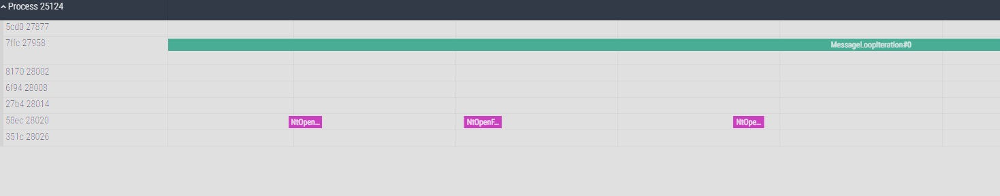

# Binary Tracer

This repository contains a very simple binary tracer that is built on top of my other [project](https://github.com/k-badz/low-overhead-profiler).

Original project allows you to do very fast tracing of your source code (check its description if you didn't already). 

What Binary Tracer is doing differently is - it allows you to do similar thing, but this time you will be able to profile a process even if you somehow forgot where your project sources are... ^^

To work, it uses quite popular technique of DLL Injection. It will first find the process you specified, then it will inject the binary tracer DLL into it, and then it will allow you to control the process of profiling. When you run it, you also supply a command text file which contains information into what the tracer should actually hook into.

This project works only on Windows 10+ x64 (I might try to port it to Ubuntu 20+ as well somewhere in the future).

## How to setup and run simple example:
1. Clone the repository (with `--recurse-submodules`)
2. Open the Visual Studio solution.
3. Compile.
4. Open Notepad.exe somewhere in the background.
5. If you want to see DLL logs, open dbgview64.exe (from SysInternalsSuite).
6. Run the target, it already has specified sample arguments with sample command file.

What will happen now, it will find the Notepad.exe process, then it will hook into NtOpenFile from NTDLL and hook into window message loop inside Notepad.exe module.

This is output you should see in the log at that point:
```
TracerDLL received parameter:
<binary_tracer_dir>\commands_example.txt
Patterns stats for event
NtOpenFile
Failed:
0
Successful:
2
Patterns stats for event
MessageLoopIteration
Failed:
0
Successful:
1
Patterns stats for event
MessageLoopIteration
Failed:
0
Successful:
1
Profiler Initialized.
Current process working directory:
<your user dir, usually>
```

And this is the output you should see in the injector console:
```
Found process with PID: 32956
DLL injected successfully.
Estimated TSC freq: 3.187167 GHz
                    3.187167 ticks per nanosecond
Profiler ready. Press Enter to start/stop profiling or type 'exit' to quit.
Profiler stopped >
```

Now, each time you hit ENTER in the console, it will switch the profiler between enabled and disabled state. Each time you disable it, it will also flush the current events.

7. Hit ENTER once in the injector console to start profiling.
8. Open new file in Notepad.exe
9. Hit ENTER once in the injector to disable the profiler and flush events.

Now, in the console you will notice more output:
```
        Profiler started.
Profiler running >
        Profiler stopped.
Profiler stopped >
```

And in the dbgview64:
```
Profiler started.
Profiler stopped and data flushed.
```

10. Now, open the process working directory you got from the first dbgview64 log.
11. You should see json trace file there, name will be something like `events_pid32956_ts5523815.json`
12. Load the trace into https://ui.perfetto.dev/
13. We can clearly see the process call this function a lot.



## How the command text file is working.
It has very simple structure, it contains row per entry, each row is:
`<PATCH_MODE> <BYTES_TO_SEARCH> <AUXILIARY_OFFSET1> <AUXILIARY_OFFSET2> <EVENT_NAME>`

`PATCH_MODE` - it specify the mode of patching, there are currently two implemented:  
- `0` - this one will try to inject tracer into relative CALL instruction (so, we patch the caller)  
- `1` - this one will try to inject at the entry of a function (here, we patch callee)  
- `2` - this one will try to inject BEGIN event at specified place (we patch inline) 
- `3` - this one will try to inject END event at specified place (we patch inline) 

`BYTES_TO_SEARCH` - this specifies the bytes sequence we need to find.

`AUXILIARY_OFFSET1` - its purpose depends on patch mode.  
- `PATCH_MODE=0` - it tells what is the offset to the interesting CALL instruction within searched pattern  
- `PATCH_MODE=1` - it tells the instruction aligned length of data we will need to copy from original function entry to the trampoline due to inserted JMP in that place. Example: JMP instruction will always require 5 bytes, so we need to override that mutch. But it might be possible that the procedure entry contains one 1-byte instruction and then second 5-byte instruction. It means we cannot just copy the five bytes from the entry because that would yield incomplete second instrution. The proper value would be 6 in that case. It will override first 5 bytes of the entry, copy first 6 bytes into the trampoline and then it will set up the trampoline to jump back into entry+6 bytes once event processing is done. Setting this properly requires woirking with disassembler, but I assume that if you lost your sources then you already know how to use that... ^^  
- `PATCH_MODE=2` and `PATCH_MODE=3` - it tells what is the offset to the place you want to put the JMP patch

`AUXILIARY_OFFSET1` - its purpose depends on patch mode.  
- `PATCH_MODE=0` and `PATCH_MODE=1` - ignored
- `PATCH_MODE=2` and `PATCH_MODE=3` - instruction aligned length of data we will need to copy (as explained above)

`EVENT_NAME` - this is any arbitrary name you want to see in the traces for that patch

## Limitations
There are a lot, I guess. This is very simple engine, not beast like DynInst or other similar stuff because its' purpose is educational.  

Two most important ones:  
For `PATCH_MODE=0` - we can only patch immediate relative calls.  
For `PATCH_MODE=1` - we do not support case where entry of the function contains relocatable offsets, as we naively copy the bytes to the trampoline

Also, patching might fail if we cannot allocate any memory near to the patched code as sometimes we are bound to 32bit relative offsets. Current code will search for proper memory, but it is not guaranteed to work.

Additionally, some of the patches rely on the fact that function we patchy into won't have any data above the RSP stack, which might not be true for very optimized functions.

## You liked it? ^^

<a href="https://buycoffee.to/kbadz"></a>  
<a href="https://buymeacoffee.com/kbaggio"></a>